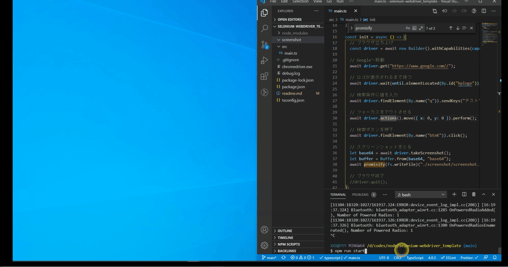

### demo

### セットアップ

npm install

### 起動

npm run start

### choromedriver.exe

version : 88.0.4324.96
https://chromedriver.storage.googleapis.com/index.html?path=88.0.4324.96/

### 参考

- node で selenium-webdriver のテンプレ
  https://qiita.com/tonio0720/items/70c13ad304154d95e4bc

- よく使う操作メソッドまとめ
  https://qiita.com/mochio/items/dc9935ee607895420186

- ElementNotInteractableError: element not interactable 解決策
  https://callcenter-trend.com/2020/01/19/selenium-04-create-test-scenario-with-selenium-and-java/#2
